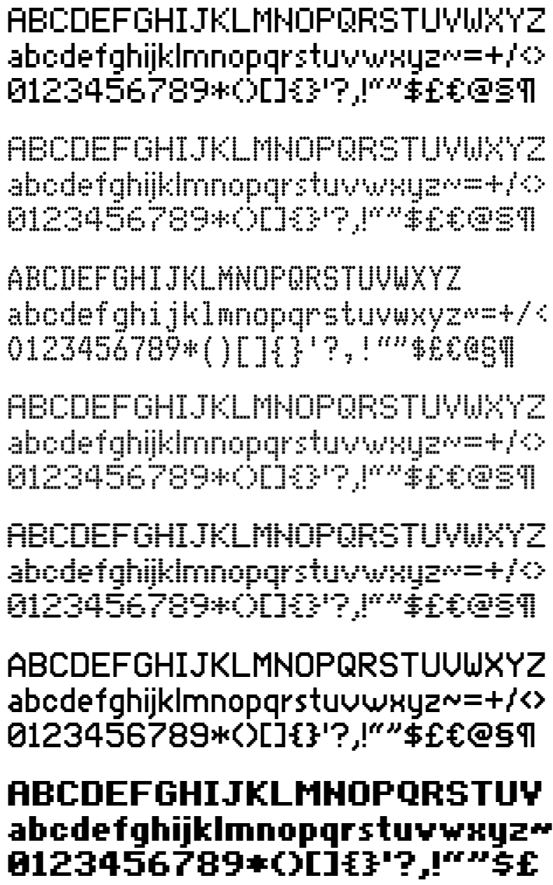

# Quantum

This is a font family for the Quikscript and Shaw (Shavian) alphabets, in the style of 9-pin dot-matrix printers and similar bitmapped displays. They contain the complete ASCII (Basic Latin) character set, the complete Quikscript alphabet in its community-standard Private Use Area encoding, the Shaw alphabet in the Supplementary Multilingual Plane, plus a few other punctuation marks and symbols necessary for typesetting simple documents in English.

## Software requirements

- Ensure Python and FontForge are installed, and both are in your PATH environment variable (so they can be invoked from the command line).
- From the root of the repo, run the command `pip install -r requirements.txt` to install the necessary Python packages.

## Building

To build the fonts from scratch, using the provided Windows batch files:

1. Run `generate.bat`; this produces the intermediate sources in UFO format
2. Run `build.bat`; this builds the final OpenType (TTF and WOFF2) fonts and patches in TTX data to some of them
   - If you wish, run `test.bat` to see Font Bakery's test results for the fonts

To easily add or modify glyphs:

1. Edit the image `glyphs.pbm` and set the corresponding glyph names in `glyphs.csv`
2. Run `step1.bat`; this produces SFD files in the `sources\temp` folder containing the designed glyphs
3. With the master source file `Quantum-MASTER-***.sfd` open in the same instance of FontForge as the temporary file, manually copy and paste the required glyphs and make any adjustments as required
   - Note that any glyphs in the `*aux.sfd` masters will automatically replace the corresponding glyphs in the main master, when the Bold and Video styles are generated